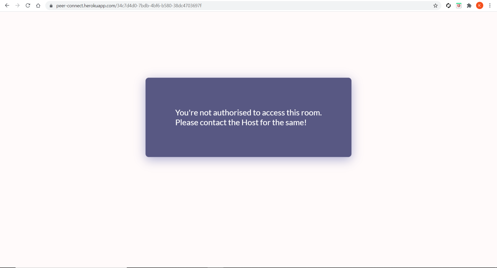

<!-- # Teams-Clone
<h2>Teams</h2>
<p>Teams is a platform where people can connect from their comfort zones. You can create your own rooms or join one if authorised by the host.</P> -->

<h1>Teams</h2> 

Teams is a platform for people to connect with each other whenever, wherever they want.

You can either create your own room or join one if authorised by the Host.

### [Link to the Website](https://peer-connect.herokuapp.com/)

<p align="center">
    
</p>
<br>


# Features

## User Authentication

Fast and Easy User Authentication using Passport JS.

### Register

<p align="center">
    
</p>
<br>

### Login

<p align="center">
    
</p>
<br>

## Private Rooms

User(Host) can create a private room with a unique Room ID that can be accessed only by the users authorised by the host.

The Host can add multiple users to his/her room at the same time by entering the email id of the attendees.

The username and email id of the host will be displayed when a room is being created.

<p align="center">
    
</p>
<br>

## Auto Suggest

<p align="center">
    
</p>
<br>

In this feature, as the host starts typing in the email id of the attendee, the data based on his search string will be displayed for his/her convenience. The host can click on the email id of the attendee displayed as a suggestion and then click the "Add Attendee" button.

Multiple attendees can be added to the meeting similarly.

The email id of the attendees added by the host will be displayed below the "Attendees" heading.

Finally, the host can click the "Start Meeting" button to start the meeting.


## Video Calling

When the host clicks on "Start Meeting", he will be directed to a Private Room with a unique ID which can only be accessed by the attendees added by him/her.

<p align="center">
    
</p>
<br>

### Join Notification

Whenever a new user joins a meeting in a particular room, all the other users of that room will be notified of his/her joining.

<p align="center">
    
</p>
<br>

### Start/Stop Video 

The user will be able to turn on/off his/her video by clicking on a button with the camera icon.

A "Red" colored camera button with respective icon denotes that the video of the user is turned off.
A "Green" colored camera button with respective icon denotes that the video of the user is turned on.

### Mute/Unmute Audio

The user will be able to Mute/Unmute his/her audio by clicking on a button with the mic icon.

A "Red" colored camera button with respective icon denotes that the video of the user is turned off.
A "Green" colored camera button with respective icon denotes that the video of the user is turned on.

<p align="center">
    
</p>
<br>


## Chat 

All users in a private room will be able to chat with each other.

A user can send a message by clicking on the "send" icon or pressing "Enter" on the keyboard.

The message will be received by all other users in that room.

<p align="center">
    
</p>
<br>

<p align="center">
    
</p>
<br>


### Leave Notification

A user can leave the meeting by clicking on the "End Call" button.

When a user leaves a meeting, all the other users of that room will be notified of his/her exit.

<p align="center">
    
</p>
<br>

The user will then be directed to a page confirming his/her exit from the meeting.

<p align="center">
    
</p>
<br>


## User Authorisation

All meeting rooms are created with User Authorisation i.e Only those users will be able to enter a room that are authorised by the host as attendees.

If a non-authorised user tries to enter a private room, he/she will be notified about the same.

<p align="center">
    
</p>
<br>


## Room Validation

If a user tries to enter a room Id that does not exist i.e the room has not been created and authorised yet, he/she will be notified about the same.

<p align="center">
    
</p>
<br>


# Tech Stack

HTML, CSS, NODEJS, JavaScript, MongoDB, Socket.io, PeerJS, PassportJS


# How to Start

Use the following commands in the terminal:

```bash
$ npm install --save   // Install dependencies
$ node app.js          // Start app.js
```

# Additional Notes

To successfully use Teams on your local machine, take note of the following things for "room_details.js" file:-

1. In line numbers 22, 31 and 37 change only the main url to 'http://localhost:3000/' for Room Creation to work successfully.   